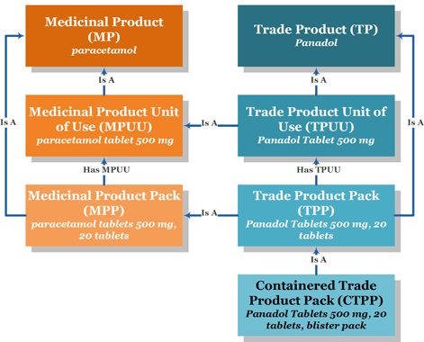

** DRAFT **

### New Zealand Medicines Terminology (NZMT) overview

The New Zealand Medicines Terminology (NZMT) database has been designed from the SNOMED design model, and is intended to provide a single, consistent database of names for medicines and trade products containing these medicines.

#### New Zealand Medicines Terminology Data Model

This is a simplified view of the structure of the NZ Medicines Terminology. It uses an example medicine to show how information is linked together.

It does not show all of the information available and the multitude of relationships that can exist. For example a medicine may be available in more than one dose form, strength and brand.

*Panadol is a registered trademark of the GlaxoSmithKline group of companies.

#### SNOMED ID Codes (SCTIDs) {#nzmt-id-details}

##### Overview
The SNOMED spec dictates that all records are identified by a globally unique 18-digit number. 
This means that you can create a single lookup table inside your database that contains all the id numbers of all the NZMT records in your database and you won’t get a single duplicate.
We used this technique to advantage in the NZMT administration system. It allowed us to quickly find the table and PreferredTerm of any record with a single lookup instead of having to seek in several different tables. It was also very useful for discovering data errors because we could find the location and purpose of any SCTID instantly. You may find similar uses.
The primary purpose of this globally unique key is to allow records from any of the Medicines Terminologies operated by SNOMED member nations to co-exist in a single database if required, and also to conform to the very flexible but rather inefficient “three-table” structure of the standard SNOMED data structure (which is not covered in this document – please ask if you need additional information).

##### ID Data Format

id numbers that are 18 digits wide are just slightly too large to fit within the largest integers supported by most databases. So all record IDs are stored as 18 character strings.
Important Note: When importing .csv files containing these fields into Excel you need to specify the fields as ‘text’.  If you don’t Excel will recognise them as numeric but will not have a sufficiently large numeric field to enter them into and so truncate them.

##### Key Structure

The 18-digit key contains (in order):
•	an 8-digit sequence number 
•	a 7-digit national “namespace” number (1000117 or 1000116)
•	a 2 digit SNOMED “type” code known as the ‘partition code’
•	a single checkdigit
E.g.: 50004811000117106 breaks down as: 5000481 – 1000117 – 10 – 6
Note 1: The Australian national namespace code is: 1000036.  You can use this to identify data imported from the AMT. 
Note 2:  We currently only use 7 of the available 8 digits in the initial sequence number, so as in our example above almost all of our SCTIDs are actually 17-character strings.
Note 3:  The SNOMED ‘partition code’ has three values: 10 for Concept IDs, 11 for Description IDs and 12 for Relationship IDs.  The example above is therefore a Concept ID and is actually the SCTID for a CTPP record.  All of the seven primary tables and of the lookup tables are considered to have Concept IDs.  The descriptions table has Description IDs, while relationship tables such as MHM and THT have Relationship IDs.
